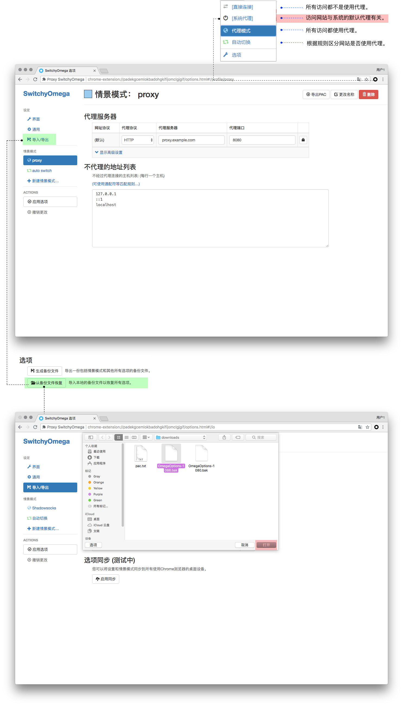

# Chrome + Proxy SwitchyOmega 设置

**您需要已经配置好代理客户端**  

## 安装扩展

未安装扩展时， Chrome 默认使用的时系统代理，所以您需要开启客户端的系统代理。

* 通过 Chrome 商店安装 [Proxy SwitchyOmega](https://chrome.google.com/webstore/detail/padekgcemlokbadohgkifijomclgjgif) 扩展。

* 单击“添加至 CHROME” >  单击 “扩展应用程序”。

 

**如果无法访问**

Chrome / Chromium  72 以上版本不再支持手动安装扩展，如果系统代理无法生效请参考：

[浏览器设置教程 -  无扩展、无系统代理情况下以代理模式启动 Chrome](chrome-start-without-system-proxy.md)

## 扩展的配置

**「推荐」** 可以直接使用本站提供的已经设置好的备份直接恢复配置。

通过右侧链接下载 SwitchyOmega 的配置文件： [SwitchOmega + GFWList 自动切换配置文件](https://raw.githubusercontent.com/Shadowsocks-Wiki/shadowsocks/master/assets/OmegaOptions-1080.bak)
(如果链接打开显示文本，请右键选择另存为，并且注意文件名不要包含 .txt)

**注：使用该备份文件时，shadowsocks 客户端的本地 socks 监听端口应当设置为 1080**

* 点击 “Proxy SwitchyOmega” > "选项" > "导入/导出" > "从备份文件中恢复" 。
* 选择刚才下载的配置文件 > "打开"。
* 点击 "Switchyomega" 图标， 可以看到如下几个模式：

|连接方式|功能|
|:--------:|:--------:|
|直接连接|所有访问都不使用代理。|
|系统代理|访问网站与系统的默认代理有关。|
|代理模式|所有访问都使用代理。|
|自动切换|根据规则自动判是否使用代理 |

> 本站提供的配置使用了 "GFWList", 可以使大部分无法直接访问的网站默认使用代理，推荐日常使用， 在下文中会包含 "自定义配置规则"。

 

## 自定义规则 适用于 Shadowsocks 客户端

* 点击"自动切换模式" > "添加条件"。

* 条件类型选择： "域名通配符"。
* 条件设置填写： "*.域名".
* 情景模式： 选 "Shadowsocks" 则经过代理， 选 “直接连接” 则不经过代理。

