TrojanX 的使用方法与 ShadowsocksX-NG 基本一致。
- 本文对应系统版本为 macOS 15.1
- 本文对应的客户端版本 1.0(1) / TrojanX-0.2.zip

## 1. 下载/安装客户端
### 1.1 下载
前往 技术支持 > 资源下载 > Trojan 进行下载： [TrojanX macOS 客户端(点击下载)](https://portal.shadowsocks.nz/dl.php?type=d&id=98)
下载得到 TrojanX-0.2.zip

### 1.2 安装
找到刚才下载的 TrojanX-0.2.zip 并解压得到 TrojanX (一般在托盘的下载文件夹中点击 TrojanX-0.2.zip 后会自动解压并弹出文件窗口)。  
将 TrojanX 文件拖动至应用程序中。  
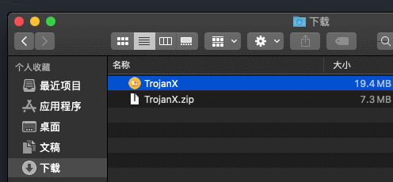  

然后找到应用程序中的 TrojanX ，初次打开时会提示无法验证开发者，点击取消然后按照下面图片所示在 Finder(访达) 中的应用程序文件夹中找到 TrojanX 右键选择打开。  
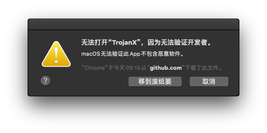    

右键选择打开。  
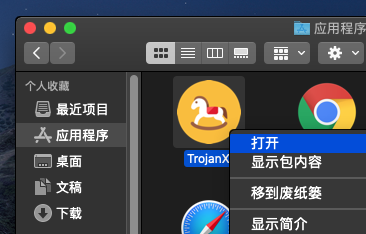  

系统会再次确认，请选择打开。  
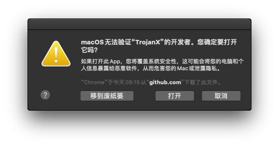  

第一次打开时需要输入用户密码进行授权，输入密码后点击好。  
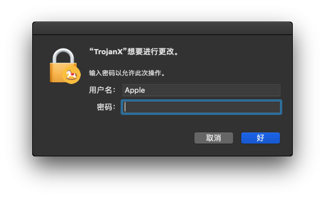  

打开后可以在右上角找到  样式的客户端图标。

## 2. 查看节点信息

登入到客户中心，依次访问 产品服务 > [我的产品与服务(点击前往)](https://portal.shadowsocks.nz/clientarea.php?action=products) ，查看 Trojan 协议对应的 `云加速服务 - Lite` 服务器信息。

## 3. 添加节点

**目前 TrojanX 客户端不支持批量导入客户端，当前推荐使用 剪贴板导入(3.3部分) 的方式添加客户端。**

### 3.1 手动添加   
右上角点击客户端图标，在菜单中点击 `服务器` > `服务器设置`，打开服务器窗口。  
按照自己的服务器信息填写后点击确定。  
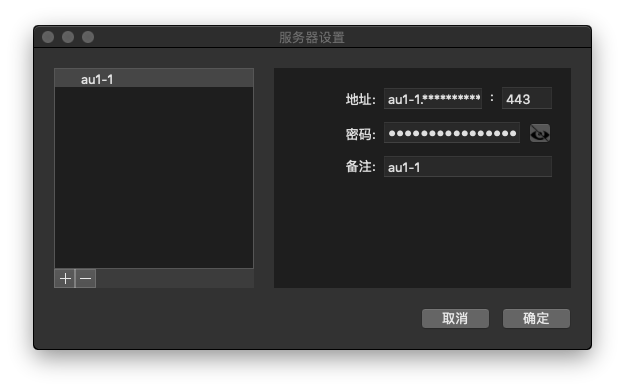  

### 3.2 扫码添加
**在我们的测试中，存在一直提示无法找到二维码的情况，当前推荐选择 3.3 剪贴板导入的方法进行添加。**

在服务详情页面，点击  打开需要添加的节点的二维码后，点击客户端菜单中的 `扫码屏幕上的二维码` 。   
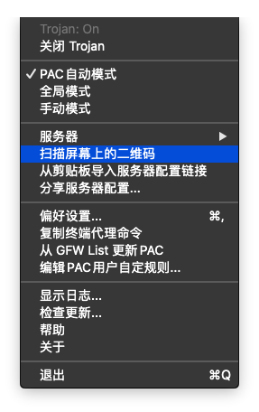

macOS 15 中扫码需要授权给客户端屏幕录制权限，否则会提示找不到二维码。   
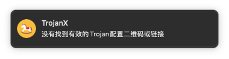

我们需要在系统设置中进行权限设置，打开 `系统偏好设置` > `安全与隐私` ，在隐私标签中，左侧找到屏幕录制，勾选 TrojanX。

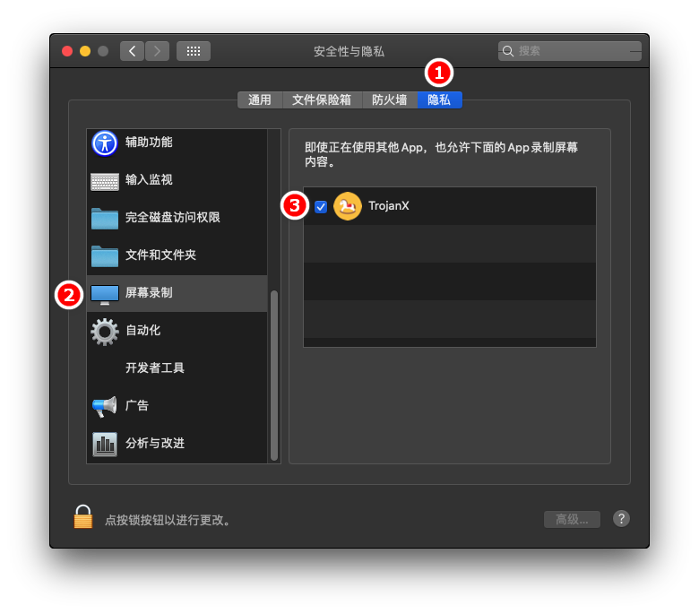

**当客户端菜单顶部显示 Trojan: On 时，表示 TrojanX 已经启用。**

### 3.3 剪贴板导入

在服务详情页面，点击  打开需要添加的节点的服务器配置页面复制 Trojan 链接。  

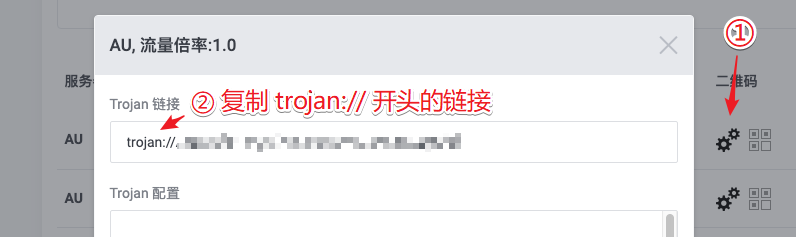

之后点击客户端菜单中的 `从剪贴板导入服务器配置链接` 即可。  
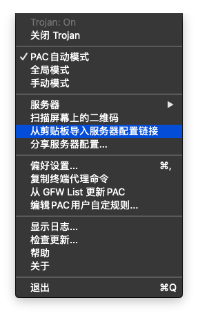

## 4. 配置系统代理模式

点击屏幕右上方菜单栏的  > `PAC 自动模式`。

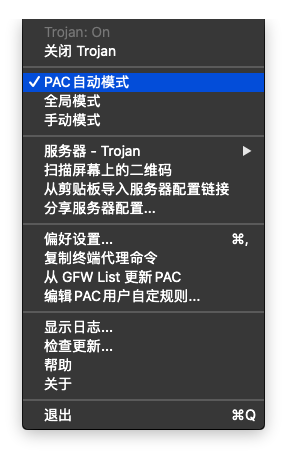

### 注意事项
- **PAC模式：** 表示可以实现自动代理，及本来可以访问的网站不会经过代理，推荐日常使用。  
- **全局模式：** 表示计算机内大多数流量都会经过代理，不推荐日常使用。  
- **手动模式：** 不设置系统代理，浏览器需要配合扩展才可以使用  
- Safari 需要使用系统代理， Firefox / Chrome 在没有安装代理扩展的情况下默认使用的也是系统代理  

## 5. 设置浏览器扩展
**TrojanX 默认提供的本地 Socks5 监听端口为 1080 ，一般情况下不需要做改动，如果有同时运行其他 Shadowsocks / V2ray 的客户端可能存在冲突，所以不要同时运行多个代理客户端。**

### 5.1 	配置 Firefox 的代理

**如需使用 Firefox 浏览器	通过代理浏览网页，请参考下面链接：**  
[Firefox + Proxy SwitchyOmega 设置](zh_CN/browser/firefox-setup-guide.md)

### 5.2 配置 Chrome 的代理

**如需使用 Chrome 浏览器通过代理浏览网页，请参考下面链接：**  
[Chrome + Proxy SwitchyOmega 设置](zh_CN/browser/chrome-setup-guide.md)
